# SilkSafar — ИИ-гид по Узбекистану

Мобильное приложение для иностранных туристов: голосовой переводчик, ИИ-гид
и карта в одном месте. Интерфейс на русском, английском, узбекском и китайском,
список языков расширяется.

Заявка на **President Tech Award 2026**, программа инкубации.

> **Это витрина, а не весь проект.** Здесь выложена часть кода — та, что
> показывает архитектуру и подход. Основной репозиторий закрытый.
> Файлы не образуют запускаемое приложение: это выдержки, а не сборка.

---

## Как это выглядит

<p align="center">
  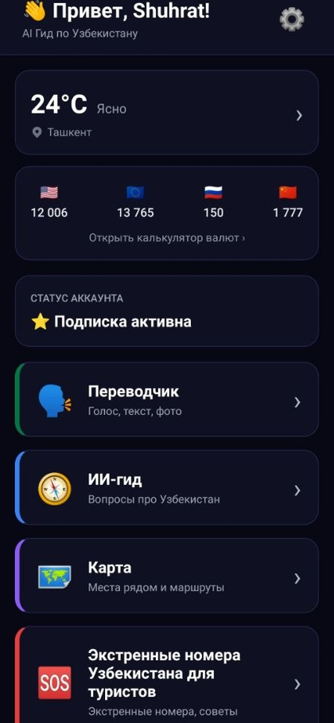
  
  
  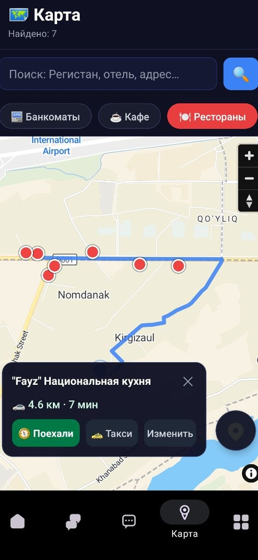
  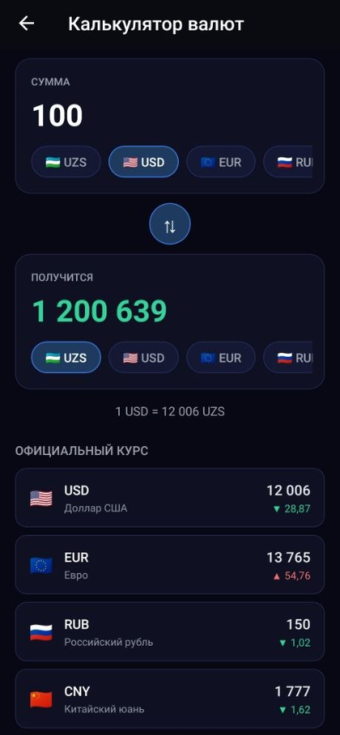
</p>

<p align="center">
  <sub>
    Главная · Переводчик · ИИ-гид строит маршрут · Карта с маршрутом и вызовом такси · Калькулятор валют<br>
    Снято в приложении версии 1.0.76. Интерфейс рабочий; дизайн-система — задача ближайших месяцев.
  </sub>
</p>

### Все экраны

<details>
<summary>Развернуть — 19 экранов приложения</summary>

**Переводчик**

<p>
  
  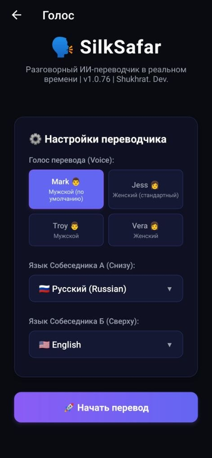
  
  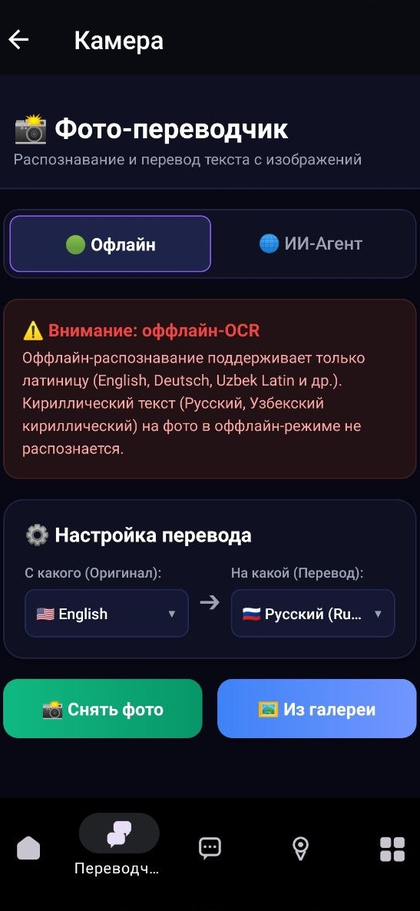
</p>

Экран текста разделён пополам, и верхняя половина перевёрнута — она для
собеседника, сидящего напротив. На экране камеры видно предупреждение о том,
что офлайн-распознавание читает только латиницу.

**ИИ-гид и карта**

<p>
  
  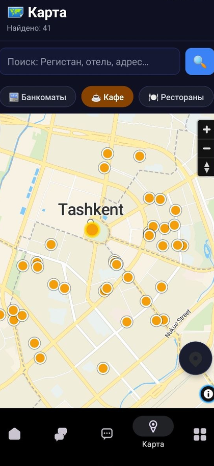
  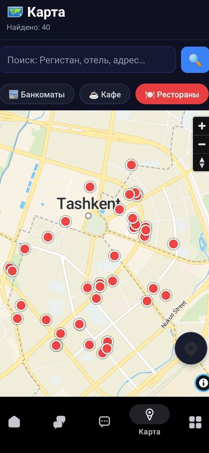
  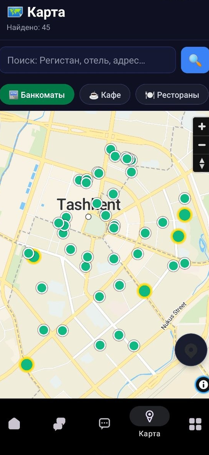
</p>
<p>
  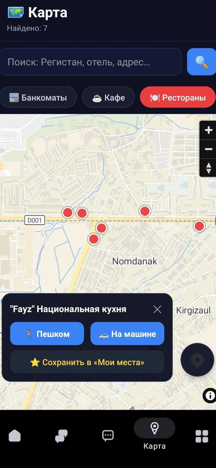
  
  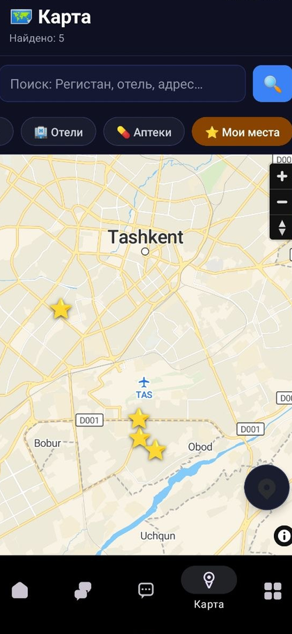
  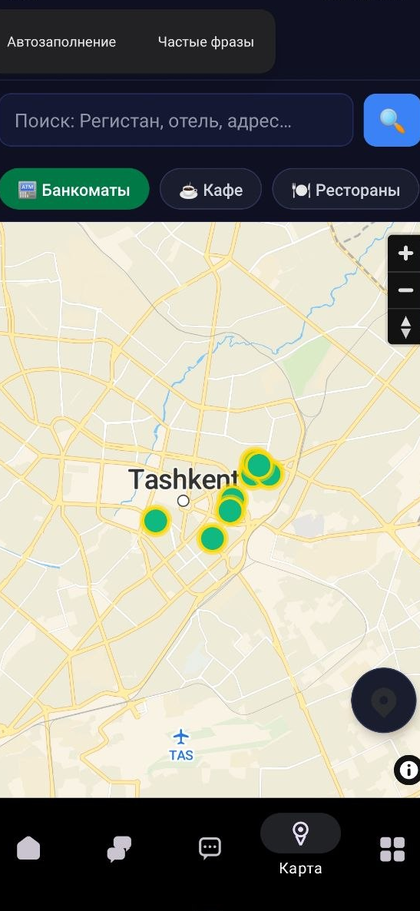
</p>

Точки на карте окрашены по категориям. По тапу открывается карточка места:
маршрут пешком или на машине и сохранение в «Мои места».

**Остальное**

<p>
  
  
  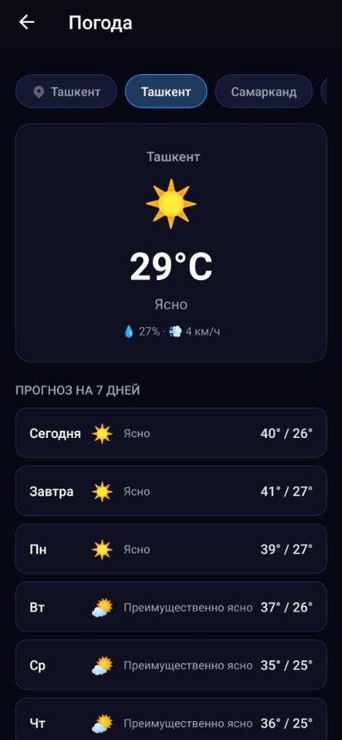
  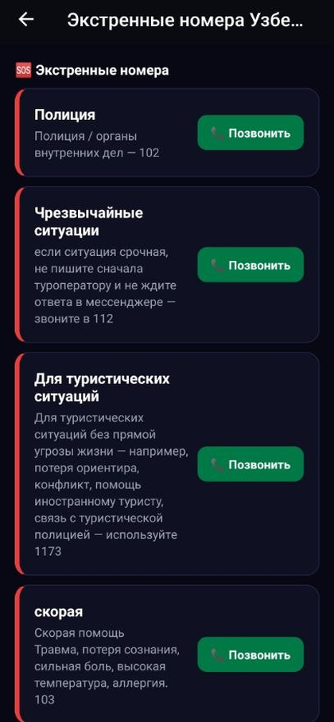
</p>
<p>
  
  
  
</p>

Раздел услуг пока наполнен одним партнёром — витрина построена, договорённости
в работе. На экране подписки видны лимиты бесплатного тарифа и то, что готовится
дальше.

</details>


---

## Скачать и попробовать

Собранный APK для Android — в разделе [**Releases**](../../releases).
Устанавливается на телефон напрямую, без магазина приложений.

При первом запуске нужно зарегистрироваться — аккаунт создаётся по e-mail
и паролю, подтверждение не требуется.

## Что умеет сегодня

| Модуль | Что делает |
|---|---|
| **Голосовой переводчик** | Живой двусторонний разговор, задержка около секунды |
| **Перевод по фото** | Камера на меню или вывеску. Латиница распознаётся офлайн, кириллица — в ИИ-режиме |
| **Офлайн-перевод текста** | Языковые модели скачиваются на устройство |
| **ИИ-гид** | Отвечает, только сверившись с данными. Показывает место, строит маршрут, вызывает такси |
| **Карта** | Банкоматы, кафе, рестораны, отели, аптеки. Маршруты пешком и на авто, свои точки |
| **Услуги** | Прокат авто, билеты, сим-карты. Партнёры добавляются из админки |
| **Погода и валюта** | Погода по местоположению, курс ЦБ с калькулятором в обе стороны |
| **Экстренная помощь** | Номера служб и справочная информация для иностранца |

## Работает без интернета

Переводчик не зависит от сети: языковые модели скачиваются на устройство,
распознавание текста со снимка тоже выполняется локально. В переводе по фото
есть переключатель **«офлайн / ИИ»** — пользователь сам решает, тратить ли
трафик.

Одна честная оговорка: офлайн-распознавание понимает **только латиницу**.
Кириллические меню и вывески переводятся в ИИ-режиме, то есть с интернетом —
приложение предупреждает об этом прямо на экране камеры.

Без сети также доступны история переводов и диалогов с гидом, последняя погода
и курс валют, и вход в аккаунт не слетает.

Это важно потому, что первые часы в стране проходят без местной сим-карты,
роуминг дорог, а в Старом городе и между городами связь слабая. Перевод нужен
именно там, где сети нет: базар, такси, аптека.

## Главное отличие: гид не выдумывает

Обычный языковой ассистент уверенно называет адрес, часы работы и цену,
которых не существует. Для туриста в чужой стране это не забавная ошибка,
а потерянный час и деньги на такси.

Наш гид устроен иначе. Любой вопрос о конкретном месте, улице или организации
**обязан начинаться с вызова инструмента** — обращения к собственной базе мест,
к карте, к курсу валют. Отвечать по памяти ему прямо запрещено, а чего в данных
нет, он честно называет неизвестным и переспрашивает.

Всего у гида **11 инструментов**: 8 на получение данных и 3 на действия
(показать на карте, построить маршрут, вызвать такси). Их определения и
исполнение — в [`backend/guide_tools.py`](backend/guide_tools.py).

## Архитектура: сменные адаптеры

Пять источников данных подключены через отдельные слои-провайдеры с одинаковым
для приложения форматом ответа. Поставщика можно заменить, **не трогая
приложение** — только реализацию адаптера на сервере.

```
приложение → бэкенд → адаптер → внешний сервис
                          ↑
                 меняется здесь, и только здесь
```

Это не теория: мы уже меняли источники на ходу. В папке
[`backend/providers/`](backend/providers) — четыре из них:

- [`poi_provider.py`](backend/providers/poi_provider.py) — места на карте
- [`geocoding_provider.py`](backend/providers/geocoding_provider.py) — поиск места по названию и обратный геокодинг
- [`weather_provider.py`](backend/providers/weather_provider.py) — погода
- [`currency_provider.py`](backend/providers/currency_provider.py) — курс валют ЦБ РУз

Пятый — маршрутизация — в закрытой части.

Про языковую модель формулировка точнее: **модель гида меняется настройкой
на сервере**, без пересборки приложения; смена поставщика модели — замена
одного модуля, а не переписывание.

## Технологии

- **Приложение** — React Native (Expo), Android; версия под iOS готова к сборке
- **Бэкенд** — Python, FastAPI, на собственном сервере, HTTPS
- **ИИ-гид** — языковая модель с вызовом функций
- **Голос** — realtime-модель через LiveKit, задержка около секунды
- **Фото и офлайн-перевод** — распознавание и перевод на самом устройстве
- **Карты** — OpenStreetMap, собственный сервер маршрутизации (пешие и авто)

## Стадия

Работающий продукт: **76 сборок**, бэкенд в production, 4 языка интерфейса,
собственная база мест с координатами, выверенными по OpenStreetMap.

Пользователей — 6 тестовых, выручки нет. Продукт есть, рынка ещё нет —
поэтому заявка в инкубацию, а не в акселерацию.

## Куда идём

**До декабря:** свои фото и видео мест на карте · отели: от ссылок
к бронированию с комиссией · партнёры в разделы билетов и сим-карт ·
многодневные маршруты от гида · обменники с курсами

**Дальше:** сообщество туристов — чат по городу и стране · маркетплейс
лицензированных гидов · офлайн-карты и пакеты городов · ремёсла
и мастер-классы · новые языки интерфейса

## Что в этом репозитории

```
backend/
  guide_tools.py            11 инструментов ИИ-гида: определения и исполнение
  import_attractions.py     импорт достопримечательностей в базу
  providers/                сменные адаптеры к внешним сервисам
mobile/
  screens/currency.tsx      экран калькулятора валют целиком
  hooks/use-my-place.ts     определение местоположения и названия города
  utils/location.ts         единая точка входа в геолокацию
  components/pin-icon.tsx   пин карты, нарисованный без иконочных шрифтов
  scripts/apply-patches.js  восстановление правок в зависимостях после установки
data/
  attractions_tashkent.json 20 достопримечательностей Ташкента с координатами
```

Отобрано так, чтобы было видно и продуктовую часть, и инженерную дисциплину.
Например, `apply-patches.js` появился после того, как выяснилось, что сборка
зависела от правки внутри `node_modules`, которой не было в репозитории.

---

## English summary

**SilkSafar** is a mobile AI travel guide for Uzbekistan: live two-way voice
translation, camera translation, an AI guide and maps — in Russian, English,
Uzbek and Chinese, with more languages to come.

Two things set it apart. The guide is **not allowed to answer from memory**:
any question about a place, street or organisation must start with a tool call
against curated data, and whatever the data does not contain is reported as
unknown rather than invented. And the translator **works without a connection** —
language models and text recognition both run on the device, which matters when
a tourist's first hours in the country pass without a local SIM.

This repository is an **excerpt** of a private codebase, published for the
President Tech Award 2026 application. The files illustrate the architecture —
in particular the swappable provider adapters — and do not form a runnable build.
An Android APK is available under [Releases](../../releases).

---

## Права

© 2026 SilkSafar. Все права защищены.

Код опубликован для ознакомления в рамках заявки на конкурс. Лицензия на
использование, копирование, изменение или распространение не предоставляется.
